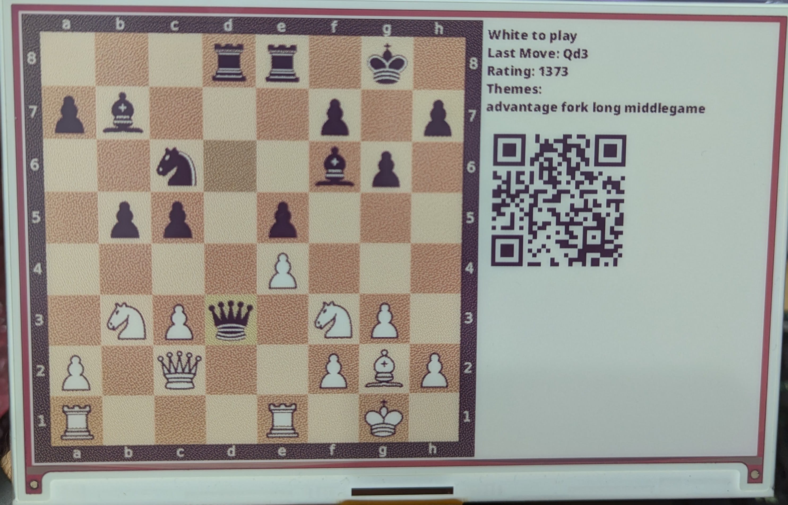
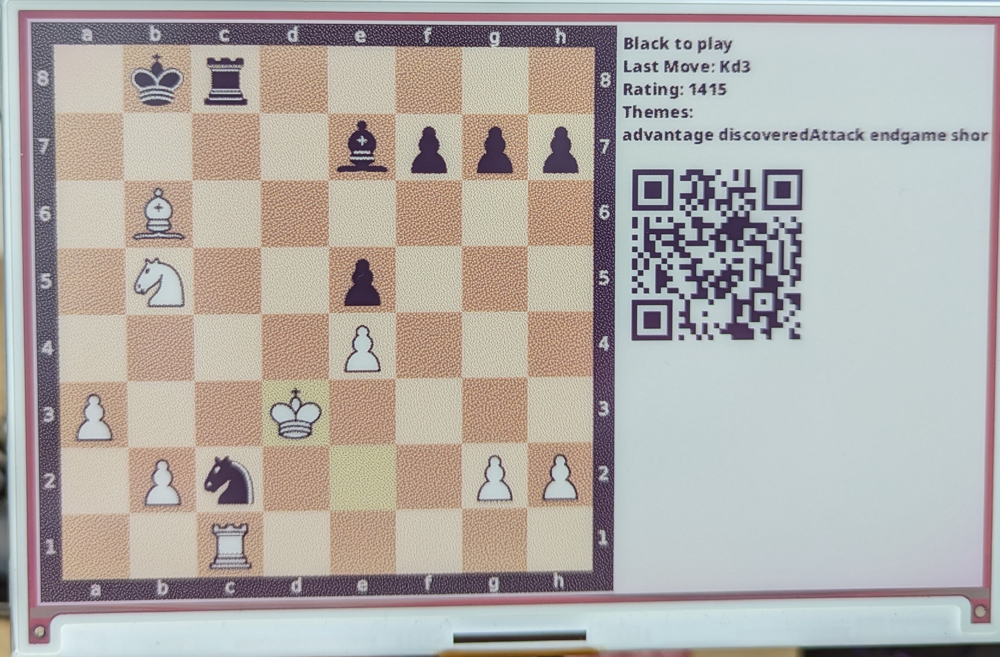

# Chess Puzzles on Inky Impression 7

This project allows you to display random chess puzzles on an Inky Impression 7.3" ePaper display. It's designed to help you improve your chess calculations from various positions and enhance your memory skills.

## Requirements
Before you begin, make sure you have the following requirements in place:

- **Raspbian OS**: Ensure you are using the Raspberry Pi's operating system.
- **Enabled IC2 and SPI Interfaces**: You can enable these interfaces using the `raspi-config` CLI. Refer to the [official documentation](https://www.raspberrypi.com/documentation/computers/configuration.html) for guidance on using this tool.
- **Inky Impression 7.3" eInk Display**: You can purchase this display from [the official site](https://shop.pimoroni.com/products/inky-impression-7-3?variant=40512683376723).
- **Compatible Raspberry Pi**: Any Raspberry Pi with a 40-pin GPIO header will work for this project.

## Features
This project offers several useful features:

- **Automatic Database Download**: It automatically downloads the lichess puzzles database and saves it locally.
- **Random Puzzle Display**: The program randomly selects a puzzle from the downloaded database.
- **Move Highlighting**: It highlights the last move made in the puzzle.
- **QR Code Encoding**: The puzzle's URL is encoded into a QR code, allowing you to check your calculation.
- **Fallback Rendering**: If Inky Impression is not detected, it renders the puzzle image on a monitor, making development faster.
- **Scheduling**: The main script can be easily scheduled (e.g., using `cron`) to render a random puzzle daily or at any desired frequency.

> Note: If you use this script with other Inky ePaper displays (e.g., Inky Impression 4"), you can adjust text-rendering coordinates in the `add_text` and `add_qr_code` functions.

## Screenshots
Check out some screenshots from this project:

- **Puzzle 1**
  
  
- **Puzzle 2**
  

## 3D Case
If you want to print a 3D case for your Inky Impression 7.3" display, you can use the following resources:

- [Pimoroni Inky Impression Case](https://www.printables.com/en/model/51765-pimoroni-inky-impression-case)
- [Inky Impression 7.3" e-Paper Frame/Case](https://www.printables.com/en/model/585713-inky-impression-73-e-paper-framecase)

This project offers an enjoyable way to enhance your chess skills and adds interactivity with the Inky Impression display. Have fun with your chess puzzles!

## Troubleshooting

If you get this error when trying to run the `main.py` script:

```log
ImportError: libopenblas.so.0: cannot open shared object file: No such file or directory
```
You need to install `libopenblas-dev` package -> `sudo apt-get install libopenblas-dev`