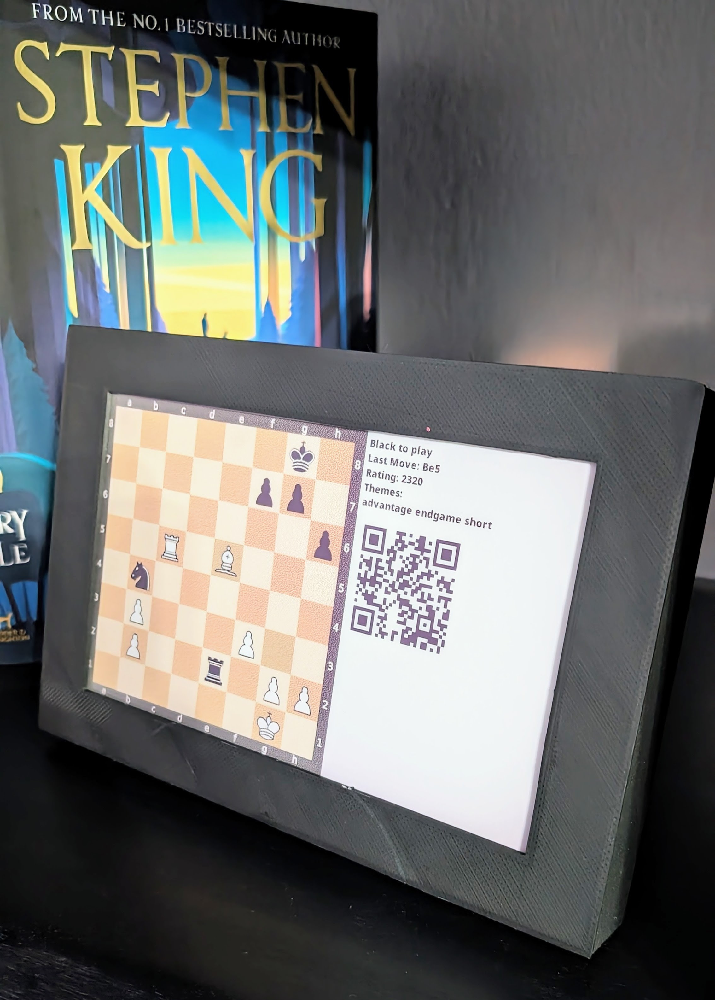

# Chess Puzzles on Inky Impression 7
Render random Chess puzzles on Inky Impression 7.3" ePaper display. That way it allows you to improve your chess calculations from a given position. It is also good for improving your special memory.

## Requirements
- Raspbian OS
- Enabled IC2 and SPI interfaces using the `raspi-config` CLI (see [official documentation](https://www.raspberrypi.com/documentation/computers/configuration.html) about the tool)
- Inky Impression 7.3" eInk display (you can buy one from [here](https://shop.pimoroni.com/products/inky-impression-7-3?variant=40512683376723))
- Compatible Raspberry pi that works with the screen above (any 40 pin pi will do) 

## Features
- Automatically downloads the lichess pizzles database and saves it locally
- Shows a randomly picked puzzle from the downloaded file
- Highlights the last move that was made
- Encodes the puzzle's URL into a QR code so you can check if your calculation is correct
- Renders the image on a monitor if Inky Impression is not detected (it makes development faster as we don't have to wait for the inky screen to render)
- The main script can be easily scheduled (e.g. using `cron`) so we can render a random puzzle every day, for example

> To use the script with other Inky ePaper displays (e.g. Inky Impression 4"), change text coordinates in the `add_text` & `add_qr_code` functions

## Screenshots

Pizzle 1

Pizzle 2

## 3D case
If you would like to print a 3D case for the display you can use those:
- https://www.printables.com/en/model/51765-pimoroni-inky-impression-case
- https://www.printables.com/en/model/585713-inky-impression-73-e-paper-framecase